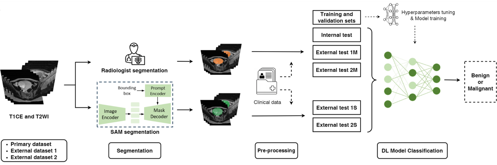

# Ovarian Classification

Code for paper [Deep Learning Models to Classify Benign and Malignant Ovarian Lesions on MRI: A Multicenter Study]()



Our study aims to develop a comprehensive end-to-end pipeline. We first evaluate SAM's performance in segmenting ovarian lesions on MRI. Building on this, we then develop a robust DL model for distinguishing between benign and malignant ovarian lesions using MRI data. By leveraging SAM-segmented images, we seek to enhance the effectiveness and generalizability of our diagnostic approach, ultimately improving clinical outcomes for patients. The workflow depicting the integration of T1CE and T2WI with ROI segmentation, pre-processed along with clinical data, into the deep learning model for lesion classification.

## Note:
```./code``` and ```./dataset``` contain the code for each component of the Ovarian classification model and pre-process code for the both T1 and T2 dataset. These programs cannot be run with the full T1/T2 ovarian dataset, but help illustrate the exact steps we did to form our projects.

```./3.	T1-2 classification model-with-clinical-dymlp-dual``` contains the model weights for the ovarian classification model. See the respective README.md in the subfolder to see how to run each component.

## Dependencies:
Using Python version of python=3.10. To establish the environment, run this code in the shell:
```
conda activate ovarian_classcify
pip install -e requrements.txt.
```
That will create the environment ovarian classification model we used.

## Usage
### Environment setup
Activate the environment by running
```
conda activate ovarian_classcify
```

### Code pipeline: data preprocess, SAM model, and classification model inference

#### Data preprocess:

Run the preprocess code
```
python classification-data-preprocessing.py
```
**Files and code organizations**:

1. T1-ROI-preprocess & T2-ROI-preprocess  % Folder that stores the preprocessed T1/T2 files. This folder will fill after running classification-data-preprocessing.py
2. label-classifyT1C+T2-clear.xlsx % Template for what this xlsx data file should contain with all column headers.
3. label-T1C+T2-clear.xlsx % Template for what this xlsx data file should contain with all column headers. 


## Citation
If you find our work helpful, please cite us

